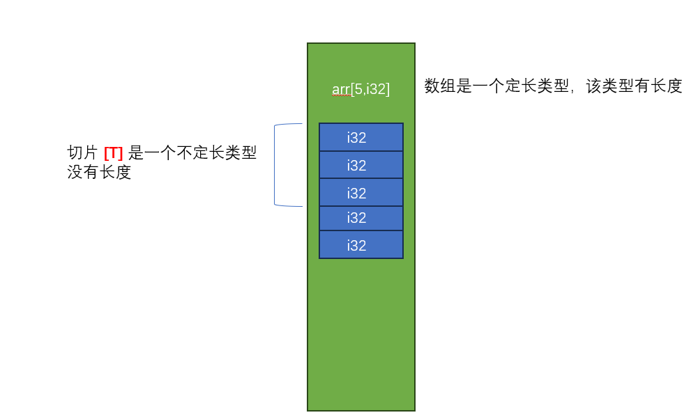

# 再谈类型

我们已经学习过了几乎所有RUST关于类型的定义，本节将针对类型的其他注意点以及使用方法 做更近一步阐述


### 类型别名

并非RUST有类型别名，甚至C里面都有类型别名`typedef` 相比较C语言，RUST类型别名更具有泛型的特点

应用场景1，类型别名可以缩短代码

```
struct ParsePayLoad<T> {
	inner: T
}

struct ParseError<E> {
	inner: E 
}

fn parse_payload<T,E> (stream: &[u8])-> Result<ParsePayLoad<T>,ParseError<E>> {
	unimplemented!();
} 
```

我们可以看到，上面的代码`parse_payload` 函数签名已经很长了，这时候可以使用类型别名

```
type ParseResult<T,E> = Result<ParsePayLoad<T>,ParseError<E>>;

fn parse_payload<T,E> (stream: &[u8])-> ParseResult<T,E> {
	unimplemented!();
} 
```

标准库中也大量使用了类似的方法，比如File模块的 关于Result重定义


### 不定长类型

我们前面介绍过的类型，几乎都是定长类型(类型的大小是确定的)，RUST中也有两种不定长的类型 

 - [T] : 切片类型，切片类型代表一个内存的不可变视图
 
 
