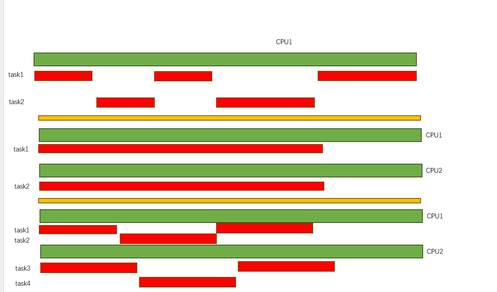

# 前置基础

考虑到每个人基础可能会不一样， 在继续了解RUST关于并发支持前 先简单介绍一下背景知识

### 并行&并发

 

并行: 任务在不同的CPU上 可以在同一时间运行
并发: 任务在同一个CPU上 交替执行，让用户感觉是在一起执行 

在现在的计算机领域，事实上 并发和并行 往往现在是同时存在的 

在继续下一个小姐之前，请回答下列问题： 

 - 为什么会有多CPU系统？
 - 实现并发并行的操作系统主要计数有哪些？

### 缺陷

OK，我们要讲一下 在多任务场景下可能带来哪些问题(我觉得大家都知道....)

 - 多任务访问 同一个内存区的竞争问题 
 - 死锁问题
 - 锁优先级反转问题
 - ....
 
 

