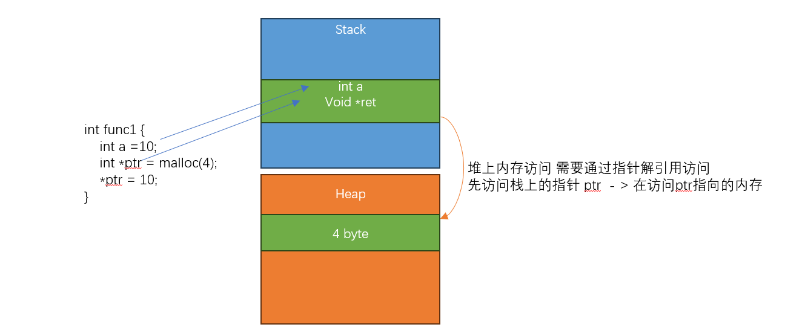
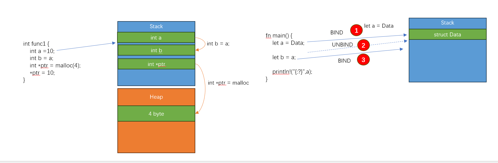

# 所有权

以下内容我会不断在这个章节的每个小节重复 

内存管理的问题: 
 
 - C语言需要程序自己管理(合理申请和释放)堆内存;管理不好后果比较严重 

内存安全的问题:  
 
 - 程序不应该访问它不应该访问的内存 
 - 不应该出现和使用 无效的内存(已经释放的内存) 
 - 代码中使用的变量或者内存，在任何时候都应该是有效的
 - 访问和使用内存不应该出现不符合预期的情况


### 何为变量？
无论访问堆或者是栈上的内存，我们之前已经讲过，都必须要通过变量访问 

变量经过编译器解释，代表的就是栈上的指针，实际生成的汇编没有变量这个概念，而是通过 `sp -4; sp -8` 这种栈指针偏移访问 

所以: 变量的类型必须是 内存大小明确的 




###在所有权之前
让我们回顾内存管理的一个问题，谁应该释放指针？

在C里面，指针是可以非常容易的传递给其他人的

```
void func2(void **ptr) {
	free(ptr2);
	//原始指针被写为NULL 是C里面一种编程习惯，防止释放的指针被继续使用
	*ptr = NULL;
}

void func() 
{
	void *ptr1 = malloc(10);
	void *ptr2 = ptr1;
	func2(&ptr2); 
	//虽然ptr2已经是NULL了，但是ptr1的指针依然还有值，但是这个时候已经 悬空了 
}
```

我们看一下上面的问题，核心在于指向 堆上一个内存区域的指针，可以被轻易的复制，也可以轻易的传递；最后结果往往就是
指向一个内存的地址，会在程序的任何地方都可以出现被使用

所有权的一个核心思想就是，能不能让一个内存，只有一个所有者？只有该所有者变量(访问内存 都需要经过变量) 有该内存的所有权


###所有权转移

所有权转移是为了 践行 所有权第一原则: 一个内存在一个时刻只能有一个所有者，如果该 所有者变量被赋值给了其他变量，则原有的变量 
不在拥有该内存所有权，所有权发生了转移，转移给被赋值的新的变量

理解为什么会报错
```
#[derive(Debug)]
struct Data;

fn main() {
	let a = Data;
	let b = a;
	
	println!("{:?}",a);
}
```

###转移和复制
上一个小节 我们已经讲了 关于所有权转移 再看一个示例 

```
fn main() {
	let a = 10_i32;
	let b = a;
	println!("{:?}",a);
}
```

？怎么不报错了呢？这涉及到另外一个问题，叫做复制 

这就需要 讲清楚  `a=b` 把一个变量赋值给另外一个变量 到底是什么意思 

在C语言里面，`a=b`的含义是 把变量b的内存(栈) 逐字节copy给变量a 让我们看一个图

下图展示了上一节的绑定转移过程，也展示了传统的C的复制过程；我们必须要知道两者的区别

**RUST 对于变量的行为 默认是采用的 绑定解绑的转移过程**



但是为什么在我们这个例子里就又不行了呢？ 原因在于 RUST 在 采用转移之前，会先查看变量是否实现了 一个叫做 Copy的特征，如果
实现了copy的特征，则会调用对象的copy函数 

```
 let a  = b; // if b has Copy trait, will call let a = b.copy()
```

所以 上面之所以没有报错 是因为 i32类型实现了Copy特征 其行为类似于C 里面的复制，会新生成一个栈上的空间 执行按位copy 

```
#[derive(Debug,Copy,Clone)]
struct Data;

fn main() {
	let a = Data;
	let b = a;
	
	println!("{:?}",a);
}
```


