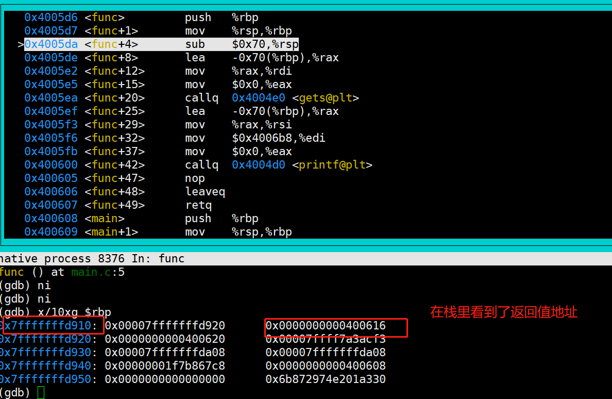

# 编程安全
本章我们会介绍最为常见的编程安全问题，只有理解这些，后面才能知道为什么RUST的目标以及为什么会流行

### 栈覆盖1

这是一个示例代码，我们尝试对其进行debug 看看会发生什么过程

```
#include <stdlib.h>
#include <stdio.h>

void func()
{
	char str[100];
	gets(str);

	printf("get str = %s \n",str);
}

int main()
{
	func();
	return 0;
}
```

我们尝试使用gdb调试一下: X86 callq 会执行压栈,函数返回地址会存储在栈顶


紧接着 我们进入函数，从下图，我们也可以得知新的函数得栈大小为 0x70,
并且变量str 也指向了栈得新地址；我们知道栈是向上增长得；




设想一下，如果我们写入字符串超过0x70(102bytes) 会发生什么


### 栈覆盖2

我们尝试修复第一个演示中的代码 

```
	struct Packet {
		int len;
		char *data;
	};

	void writePacket(struct Packet *p)
	{
		printf("packet:%s len is %d\n",p->data,p->len);
		char str[100]; 
		if (p->len < 100) {
			//snprintf第二个参数是size_t，是unsigned int; 这里发生了类型转换，就算检查成功，
			//负数会变成一个很大的无符号数
			snprintf(str, p->len, "%s", p->data);
		}
		printf("get str is %s\n",str);
	}
	
	int main()
	{	
		struct Packet p = {10, "123456789"};
		writePacket(&p);
		p.len = -1; //注意这里
		p.data = "00000000000000000000000000000000000000000000000000000000000000000000000000000000000000000000000000000000000000000000000000000000000000000000";
		writePacket(&p);
		return 0;
	}
```

尝试运行这段代码，依然会溢出,  

我们可以把上面的问题怪程序员吗？
 - 我们无法保证每一个编程人员都是优秀的程序员(基础理论很扎实，具备安全意识)
 - 无法保证优秀的程序员不会犯错：是的，常在河边走 哪有不湿鞋 

```rust,editable

// 填空
fn main() {
    let n = 5;

    if n < 0 {
        println!("{} is negative", n);
    } __ n > 0 {
        println!("{} is positive", n);
    } __ {
        println!("{} is zero", n);
    }
} 
```